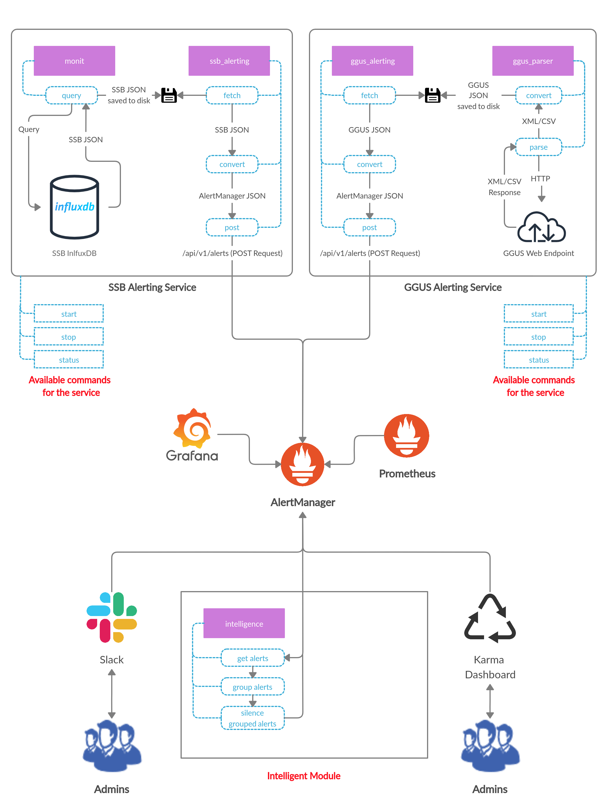
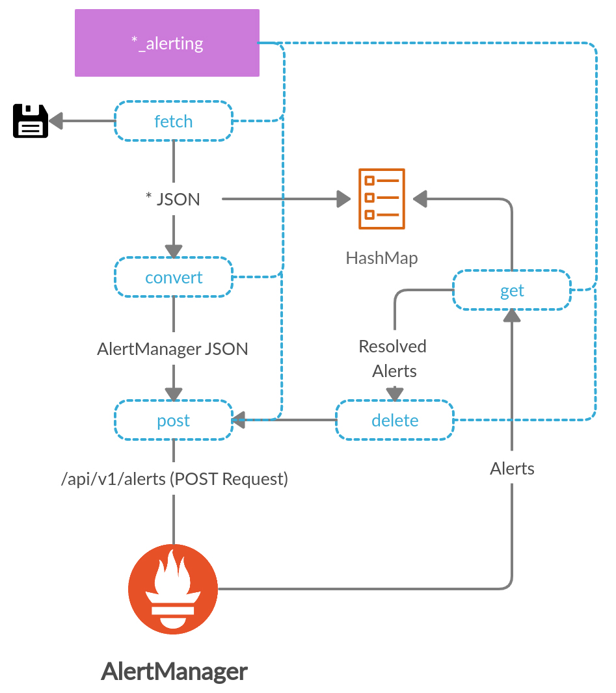
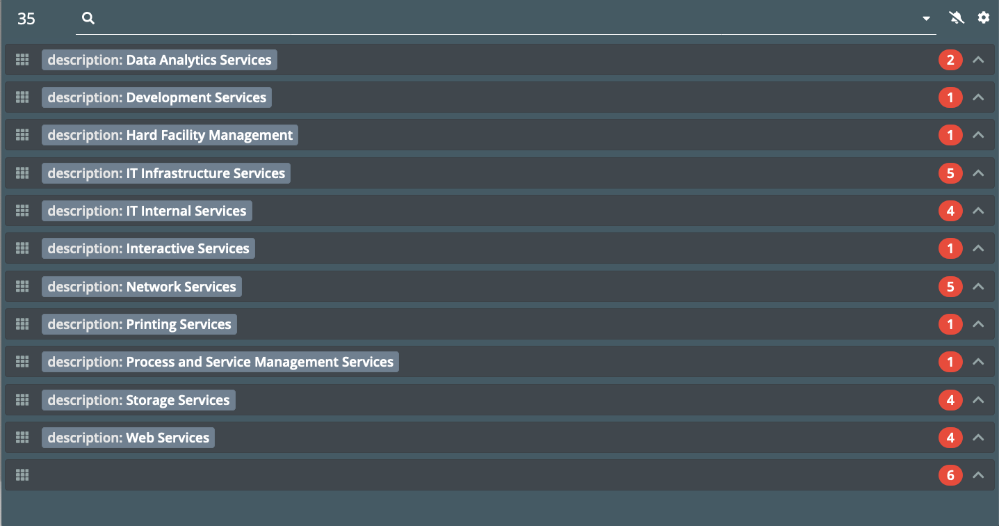

# AlertManagement

## Overview

The growth of distributed services introduces a challenge to properly monitor their status and reduce operational costs. In CMS experiment at CERN we deal with distributed computing infrastructure which includes central services for authentication, workload management, data management, databases, etc. To properly operate and maintain this infrastructure we rely on various open-source monitoring tools, including ElasticSearch, Kafka, Grafana stack (used by central CERN MONIT infrastructure), Prometheus, AlertManager, VictoriaMetrics software components (used by the experiment), as well as custom solutions like GGUS WLCG or ServiceNow ticketing systems.

On daily basis these CMS computing infrastructure may produce significant amount of information about various anomalies, intermittent problems, outages as well as undergo scheduled maintenance. Therefore the amount of alert notifications and tickets our operational teams should handle is very large. We’re working towards, an Operational Intelligent System aiming to detect, analyse, and predict anomalies of the computing environment, to suggest possible actions, and ultimately automate operation procedures. An important component of this system should be an intelligent Alert Management System.

The system should collect anomalies, notifications, etc., from ES, InfluxDB, Prometheus data-sources, GGUS system and be able to aggregate, and create meaningful alerts to address various computing infrastructure failures. For instance, if certain component of global distributed system experiences a problem in terms of its storage the Alert Management system should notify via appropriate channels a set of instructions on how to fix and handle this situation. Before sending the alert it should check if this is a real anomaly or part of on-going outage, or schedule maintenance.

## Architectural Diagram


## SSB Alerting Service
Files included in this service are :-
1) monit
2) ssb_alerting
3) ssb_alert.sh
4) ssb_alert_manage

### monit
The program which is responsible for the SSB queries from InfluxDB. A query can be manually drafted according to our needs. 

An example of such a query :-

```monit -query="select * from outages where time > now() - 2h" -dbname=monit_production_ssb_otgs -token=$token -dbid=9474```

where we are fetching outages record of last 2 hrs.

### ssb_alerting
monit queries from InfluxDB and dumps the result on stdout which can be dumped on the disk. ssb_alerting fetches dumped SSB JSON Data and converts it to a JSON format which AlertManager's API understands. There could be one issue where some of SSB alerts have no EndTime, i.e. they have open ending. So to solve this issue on each iteration we fetch alerts from AlertManager and check if some alerts having open ending are resolved or not from the maintained HashMap which has information about current alerts. If they are resolved they are pushed with current time as EndTime i.e. we delete those alerts from AlertManager.

```
Usage of ssb_alerting:
  -input string
    	input filename
  -url string
    	alertmanager URL
  -verbose int
    	verbosity level
```
The dataflow and logic behind ssb_alerting tool can be well visualized in the below diagram. 
{:height="400px" width="400px"}

### ssb_alert.sh
A simple bash script which makes the above process automated on configurable time interval value.
```
Script for fetching CERN SSB info and injecting it into MONIT (AlertManager)
Usage: ssb_alerts.sh <query> <token> [cmsmon_url] [interval] [verbose]"

  <query>       CMS Monit ES/InfluxDB Query
  <token>       User's Token
   
Options:
  cmsmon_url    CMS Monitoring URL                              (default: https://cms-monitoring.cern.ch)
  interval      Time interval for Alerts ingestion & injection  (default: 1)
  verbose       Verbosity level                                 (default: 0)
  ```
### ssb_alert_manage
A Linux Daemon for our ssb_alerting mechanism which makes possible to run our service in background giving access to major commands like start, stop, status, help.
Few Environment Variables are required to be set ( PS. some of them have default values.) which makes the whole service easily configurable. 

```
Environments:
  QUERY       :   CMS Monit ES/InfluxDB Query              
  TOKEN       :   User's Token
  CMSMON_URL  :   CMS Monitoring URL                              default - https://cms-monitoring.cern.ch"
  INTERVAL    :   Time interval for Alerts ingestion & injection  default - 1
  VERBOSE     :   Verbosity level                                 default - 0
```
## GGUS Alerting Service
Files included in this service are :-
1) ggus_parser
2) ggus_alerting
3) ggus_alert.sh
4) ggus_alert_manage

### ggus_parser
The program which uses HTTP request to fetch GGUS Tickets using CERN Grid Certificate in XML/CSV Format which is then parsed and converted into usable JSON Format and dumped to the disk.

### ggus_alerting
ggus_alerting fetches dumped SSB JSON Data and converts it to a JSON format which AlertManager's API understands. There could be one issue where some of GGUS alerts have no EndTime, i.e. they have open ending. So to solve this issue on each iteration we fetch alerts from AlertManager and check if some alerts having open ending are resolved or not from the maintained HashMap which has information about current alerts. If they are resolved they are pushed with current time as EndTime i.e. we delete those alerts from AlertManager.

```
Usage of ggus_alerting:
  -input string
    	input filename
  -url string
    	alertmanager URL
  -verbose int
    	verbosity level
  -vo string
    	Required VO attribute in GGUS Ticket (default "cms")
```
The dataflow and logic behind ggus_alerting tool can be well visualized in the below diagram. 
{:height="400px" width="400px"}

### ggus_alert.sh
A simple bash script which makes the above process automated on configurable time interval value.
```
Script for fetching GGUS Tickets and injecting them into MONIT (AlertManager)
Usage: ggus_alerts.sh [ggus_format] [cmsmon_url] [interval] [vo] [timeout] [verbose]"

Options:
  ggus_format   GGUS Query Format ("csv" or "xml")              (default: "csv")
  cmsmon_url    CMS Monitoring URL                              (default: https://cms-monitoring.cern.ch)
  interval      Time interval for Alerts ingestion & injection  (default: 1)
  vo            Required VO attribute                           (default: "cms")
  timeout       HTTP client timeout operation (GGUS Parser)     (default:0 - zero means no timeout)
  verbose       Verbosity level                                 (default: 0)
  ```
### ggus_alert_manage
A Linux Daemon for the ggus_alerting mechanism which makes possible to run our service in background giving access to major commands like start, stop, status, help.
Few Environment Variables are required to be set ( PS. some of them have default values.) which makes the whole service easily configurable. 

```
Environments:
  GGUS_FORMAT :   GGUS Query Format("csv" or "xml")               default - "csv"
  CMSMON_URL  :   CMS Monitoring URL                              default - https://cms-monitoring.cern.ch"
  INTERVAL    :   Time interval for Alerts ingestion & injection  default - 1
  VO          :   Required VO attribute                           default - "cms"
  TIMEOUT     :   HTTP client timeout operation (GGUS Parser)     default - 0 (zero means no timeout)
  VERBOSE     :   Verbosity level                                 default - 0
```

## Karma Dashboard
"Alertmanager UI is useful for browsing alerts and managing silences, but it’s lacking as a dashboard tool - karma aims to fill this gap."     
-Karma Developer

We can build the docker container using Karma Dockerfile.

```docker build -t <CERN_REPO./karma <path-to-Dockerfile>```

Required Environment Variable for docker container -

```ALERTMANAGER_URI ```

Karma Dashboard can be configured using `karma.yaml` file.
```
ui:
    refresh: 30s
    hideFiltersWhenIdle: true
    colorTitlebar: false
    theme: "auto"
    minimalGroupWidth: 420
    alertsPerGroup: 6
    collapseGroups: collapsed
    multiGridLabel: "tag"
    multiGridSortReverse: false
```

k8s manifest files can be used to deploy the karma dashboard on CERN Kubernetes infrastructure.

Below screenshot shows the karma dashboard with alerts from both of the services developed.

