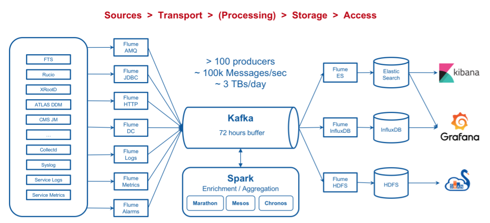

# The MONIT infrastructure

## Data sources and visualisation/access

The CMS MONIT data sources are:
* [ElasticSearch](https://www.tutorialspoint.com/elasticsearch/index.htm), for raw (time retention 30-40 days) and aggregated data. Can be accessed trough [Kibana](Kibana.md), [Grafana](Grafana.md), [API token](Grafana.md#grafana-token)
* [InfluxDB](https://www.influxdata.com/products/influxdb-overview/), can be accessed through [Grafana](Grafana.md), [API token](Grafana.md#grafana-token)
* [HDFS](https://www.geeksforgeeks.org/hdfs-commands/), can be accessed via spark jobs and SWAN service. Check [here](HDFS.md) for tutorials.

## Data injection

## Documentation from MONIT

* [CERN OpenStack Cloud guide](https://clouddocs.web.cern.ch/clouddocs/)
* [CERN MONIT infrastructure](http://monit-docs.web.cern.ch/monit-docs/overview/index.html)

## MONIT Architecture

