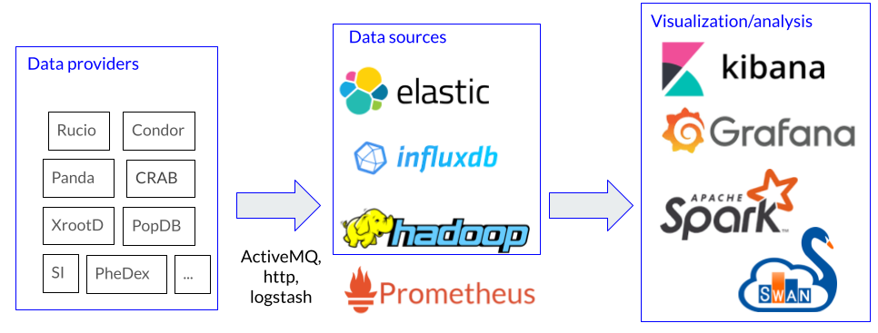

# Welcome to the CMS monitoring documentation

* Documentation on CERN IT MONIT [infrastructure](MONIT/README.md) (Grafana, Kibana, ElasticSearch, AMQ, HDFS, Spark, CMS data sources and code)
* Documentation on CMS monitoring [infrastructure](infrastructure/README.md) (Prometheus, AlertManager, NATS, k8s)
* Documentation for monitoring [operators](operators.md)

Problems? Questions? Please open a [JIRA ticket](https://its.cern.ch/jira/browse/CMSMONIT)

