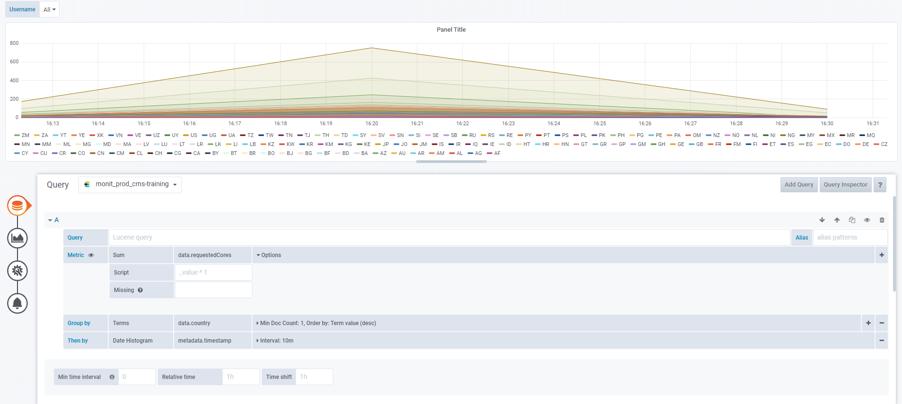
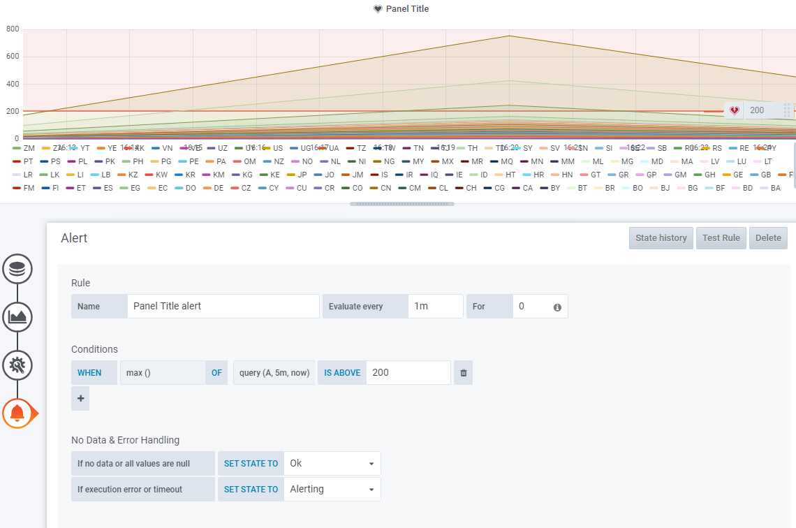
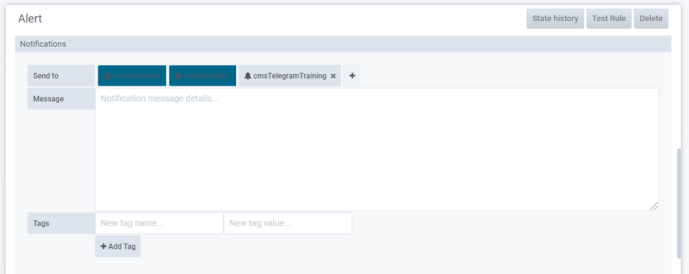

# Alerts on Grafana

You can define alert rules for a time-based plot in Grafana. Before trying to create a new alert we need to take into consideration:

- Alerts cannot be defined with queries using (user-defined) template variables. 
- You can send an alert to multiple notification channels. Notification channels can be defined to send email, slack or telegram message, or to use an endpoint (for example, to create a snow ticket). 
- Only admins can create notification channels, but any user with edit permissions over a dashboard can define an alert. If you need a new channel, you can coordinate with the CMS Monitoring team to create one.

## Create the alert

For this, you will need to create a plot query that doesn't use (user-defined) template variables.

> **Note**: If you are using a data source like InfluxDB, and you are writing the query using the edit mode of the query editor, you will need to use the  build-in `$timeFilter` variable [in your query](https://grafana.com/docs/grafana/latest/features/datasources/influxdb/).

The alert rule is evaluated for each series in the plot. For example, if we want to know when a country has requested more than 200 cores in a given 10 minutes interval, we will want to group by country in the query. Take a look at the name of the query (e.g. `A`)

Then we will want to configure the alert. For this training, we have created a telegram channel to get the alerts, and the corresponding notification channel in Grafana. The notification channel is called `cmsTelegramTraining`.

To see the resulting alerts in telegram you can use this link https://t.me/cmsmonittraing.

To create the alert we need to go to the alert tab and click on the create alert button. 

To define the rule we need to define how often it will be evaluated, for how long it should be matching before firing the alert, what query to use(e.g. A), with which time interval, with which aggregation, and the threshold (below or above a value, or within a range). 

We also need to define the behavior when the query returns no data or when there is an execution error. 

Once we test the alert, we can define the notification message and select the notification channel. There are some channels selected by default, they cannot be removed, you can add as many additional channels as you want. Select the Telegram channel. 

Now you can test the alert, using the test alert button, and save the dashboard. 

Send data again to see the results. 

