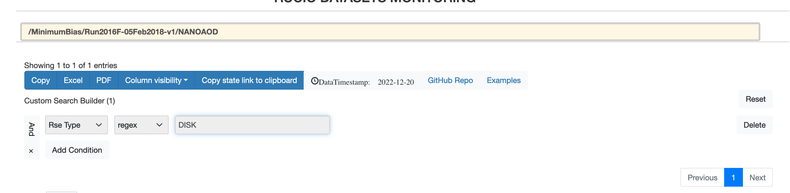
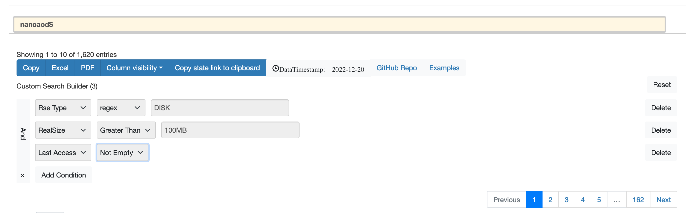
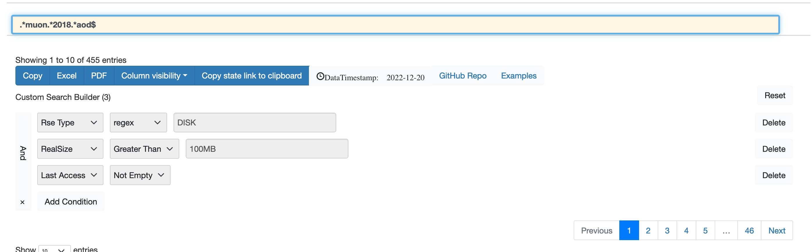

#### Example1:

Full dataset name, only on DISK

---

#### Example2:

NANOAOD datasets, accessed and on DISK. `$ at the end means dataset name will end with nanoaod`

---

#### Example3:

Special regex for AOD datasets

